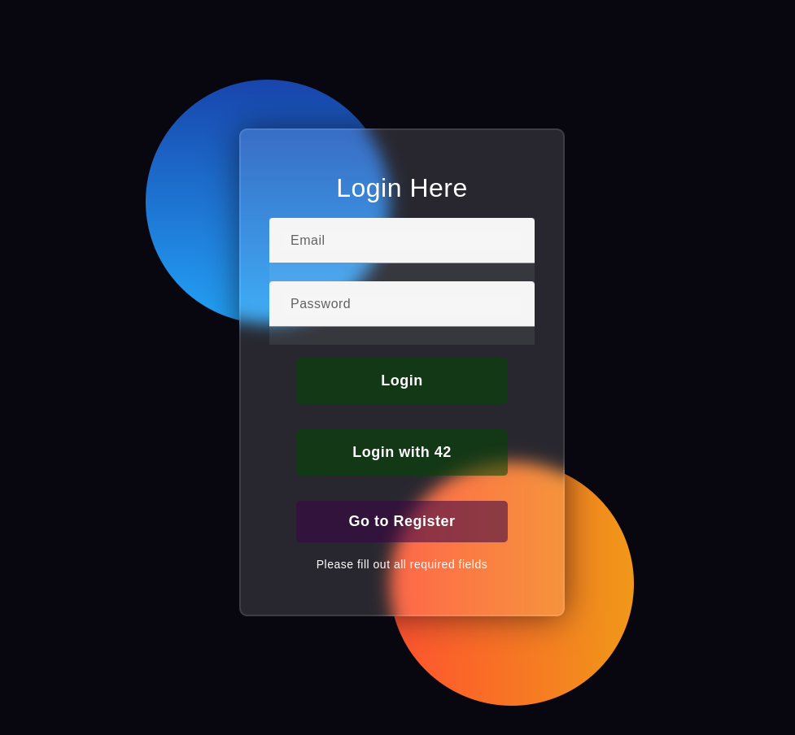
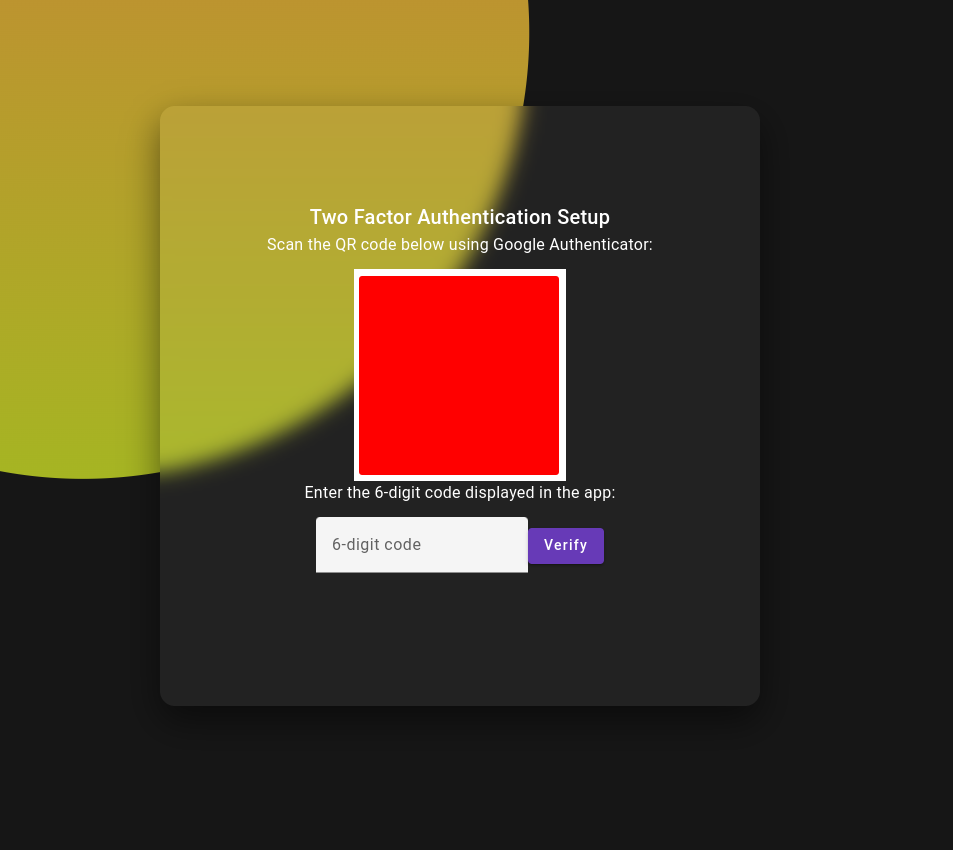
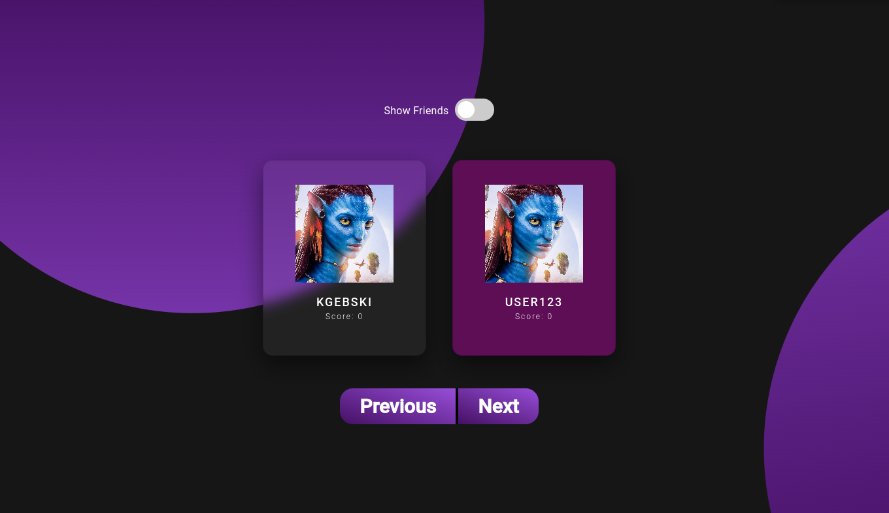
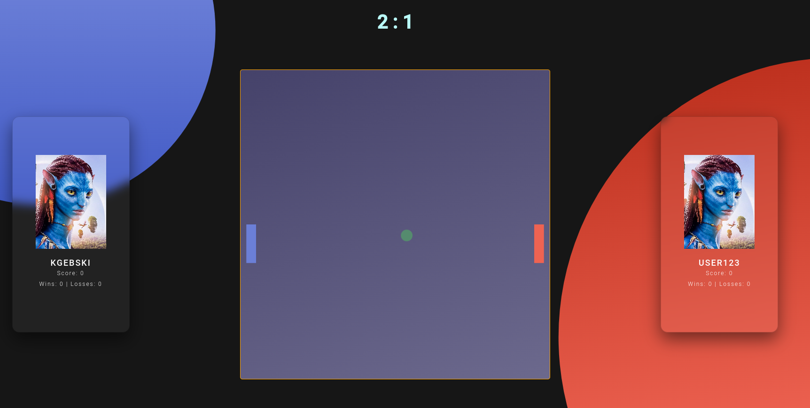
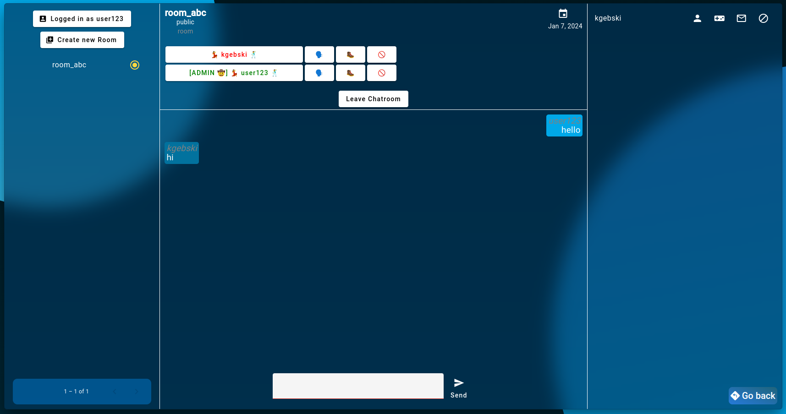
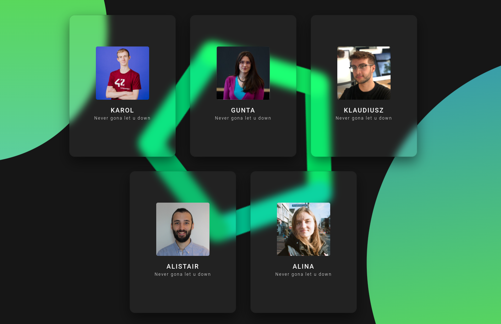

# ft_transcendence
<div align="center">
	
	
	
	
	
	
</div>

Full-stack web application developed as part of the 42 curriculum. Functionality includes multiplayer Pong game, user authentication, chat, matchmaking, and leaderboards. 
Built using TypeScript, Angular and NestJS, the project emphasises modern web development practices, secure user management, Docker deployment, and a responsive UI.

### Key Features:
 - Single-page application
 - Protected against SQL injections and hashed saved passwords
 - Login using the OAuth system of internal intranet
 - Two-factor authentication. For instance, Google Authenticator
 - Full chat functionality with direct messages and blocking
 - Synchronous, real-time Pong game featuring live player matchmaking, interactive gameplay, and persistent leaderboards

### Quick Start:

  -  create & set config of .env file
  -  ```docker-compose up --build```

<p align="center">
  
  <br>
  
  <br>
  
  <br>
</p>
